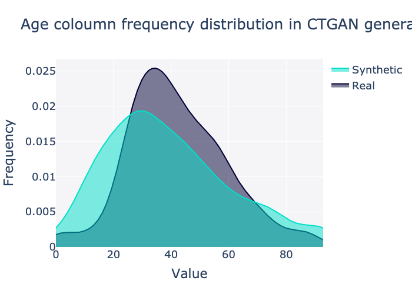
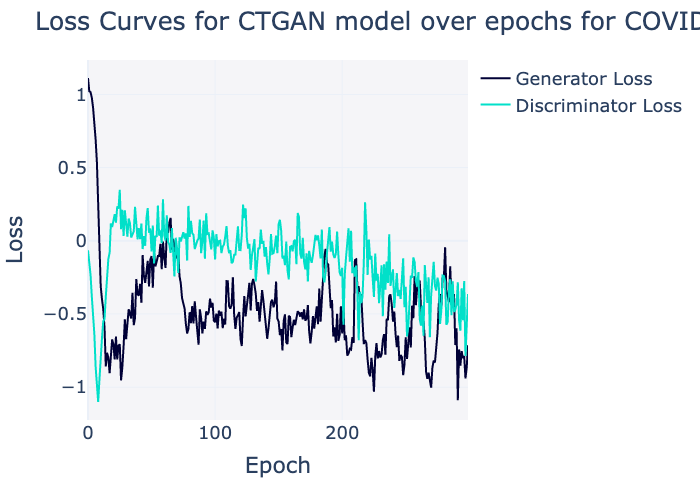
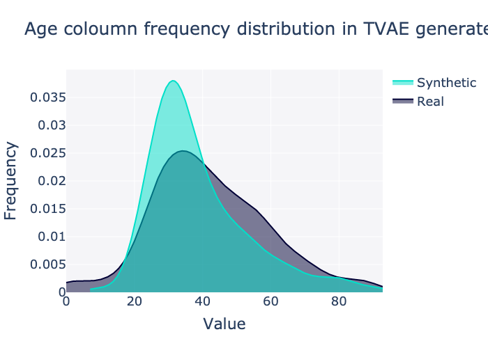
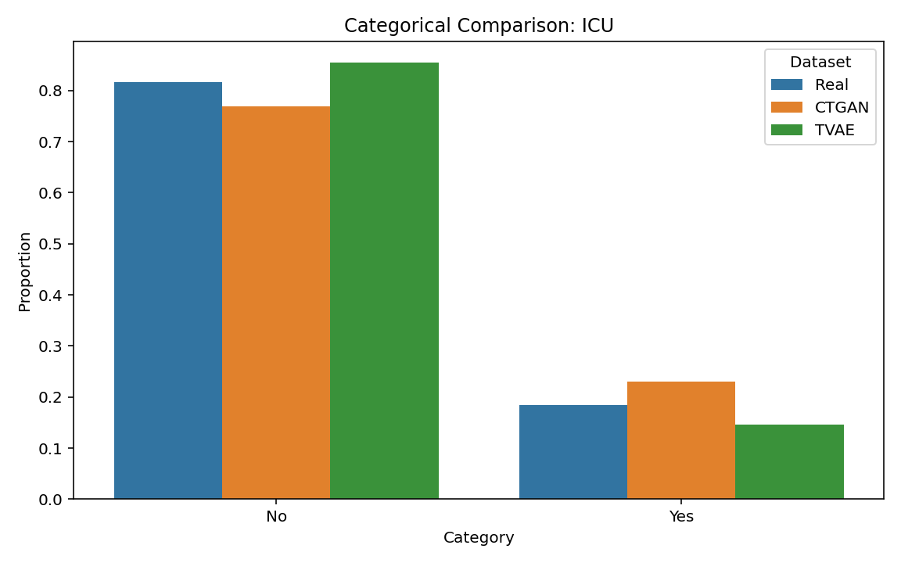
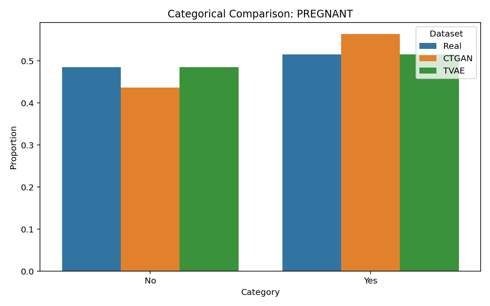

#  Synthetic Data Generation for Healthcare Analysis using GANs

##  Overview

This project explores the use of advanced deep learning models — specifically **Conditional GANs (CTGAN)**, **TVAE**, and **Gaussian Copula** — to generate synthetic healthcare datasets based on real-world COVID-19 patient records in Mexico and the real-world Heart Disease Predictors dataset from Cleveland, Hungary, Switzerland, and the VA Long Beach.

The synthetic data generated preserves the statistical properties of real patient data while ensuring privacy, making it highly valuable for research and development in sensitive domains like healthcare.

---

##  Objectives

1. Preprocess real-world healthcare data, addressing missing and inconsistent entries.
- Train synthetic data generators using:
  - CTGAN (Conditional Tabular GAN)
  - TVAE (Tabular Variational AutoEncoder)
  - Gaussian Copula
- Evaluate data quality using `SDV`'s diagnostic reports.
- Visualize distribution comparisons between real and synthetic data.
- Train a Random Forest classifier on the synthetic data.
- Apply SHAP (SHley Additive exPlanations) for interpretability and feature importance analysis.

---

##  Dataset
**1) COVID-19 Datset**

The dataset is derived from a publicly available **COVID-19 Mexican Patient Health Record**, including:

- Demographics: Age, Sex
- Health conditions: Hypertension, Diabetes, Asthma, etc.
- Patient classification: ICU admission, recovery, or death

**Note:** Values such as `97` and `99` were used to represent missing data and were cleaned during preprocessing.

>Nizri, M. (2023). COVID-19 Dataset: COVID-19 patient's symptoms, status, and medical history. Kaggle. Retrieved from https://www.kaggle.com/datasets/meirnizri/covid19-dataset

**2) Cardiovascular Risk Factors Dataset**
The dataset is derived from a publicly available dataset at **UC Irvine Machine Learning Repository** including:

- Demographics: Age, Sex
- Health Condition: Serum Cholesterol, Resting Heart Rate, etc.
- Lifestyle choices- Exercise, Cigarettes, etc.
- Patient classification: Diagnosis of heart disease.


>Janosi, A., Steinbrunn, W., Pfisterer, M., & Detrano, R. (1989). Heart Disease [Dataset]. UCI Machine Learning Repository. https://doi.org/10.24432/C52P4X.

---
## Statistical Summary
```

 Summary Statistics - Real Data:
             USMER  MEDICAL_UNIT  ...  CLASIFFICATION_FINAL          ICU
count  1000.000000   1000.000000  ...            1000.00000  1000.000000
mean      1.616000      8.945000  ...               5.34500     1.785000
std       0.486601      3.743259  ...               1.87923     0.450531
min       1.000000      2.000000  ...               1.00000     0.000000
25%       1.000000      4.000000  ...               3.00000     2.000000
50%       2.000000     12.000000  ...               6.00000     2.000000
75%       2.000000     12.000000  ...               7.00000     2.000000
max       2.000000     13.000000  ...               7.00000     2.000000

[8 rows x 20 columns]

 Summary Statistics - Synthetic Data CTGAN:
             USMER  MEDICAL_UNIT  ...  CLASIFFICATION_FINAL          ICU
count  1000.000000   1000.000000  ...           1000.000000  1000.000000
mean      1.571000     10.055000  ...              5.407000     1.693000
std       0.495181      3.257697  ...              1.854397     0.546855
min       1.000000      2.000000  ...              1.000000     0.000000
25%       1.000000      9.000000  ...              3.000000     1.000000
50%       2.000000     12.000000  ...              6.000000     2.000000
75%       2.000000     12.000000  ...              7.000000     2.000000
max       2.000000     13.000000  ...              7.000000     2.000000

[8 rows x 20 columns]

 Summary Statistics - Synthetic Data TVAE:
             USMER  MEDICAL_UNIT  ...  CLASIFFICATION_FINAL          ICU
count  1000.000000   1000.000000  ...           1000.000000  1000.000000
mean      1.809000     10.429000  ...              5.511000     1.854000
std       0.393286      3.183881  ...              1.933809     0.353283
min       1.000000      3.000000  ...              3.000000     1.000000
25%       2.000000     12.000000  ...              3.000000     2.000000
50%       2.000000     12.000000  ...              7.000000     2.000000
75%       2.000000     12.000000  ...              7.000000     2.000000
max       2.000000     12.000000  ...              7.000000     2.000000

[8 rows x 20 columns]
```

---
## Visuals

### 1. CTGAN

**Figure 1:** Frequency Distribution of continuous Variable `Age` in the synthetic dataset synthesized by CTGAN Synthesizer for the COVID-19 dataset.


**Figure 2:** Frequency Distribution of continuous Variable `Age` in the synthetic dataset synthesized by CTGAN Synthesizer for the Cardiovascular Risk Factors dataset.


**Figure 3:** Generator and discriminator loss curves of the CTGAN model over training epochs for the COVID-19 dataset. The figure illustrates the adversarial training dynamics, showing convergence behaviour and relative stability between the generator and discriminator during model training.


**Figure 4:** Generator and discriminator loss curves of the CTGAN model over training epochs for the Cardio Dataset.

---
### 2. TVAE


**Figure 5** Frequency Distribution of continuous Variable `Age` in the synthetic dataset synthesized by TVAE Synthesizer for the COVID-19 dataset.

---
### 3. Copula GAN Synthesizer

**Figure 6:** Frequency Distribution of continuous Variable `Age` in the synthetic dataset synthesized by Copula GAN Synthesizer for the COVID-19 dataset.

---
### 4. SHAP values for the Random Forest Model trained on synthetic data generated from CTGAN and TVAE.


**Figure 7** SHAPly values for a Random Forest Model trained on CTGAN-generated synthetic data for the COVID-19 dataset.  


**Figure 8** SHAPly values for a Random Forest Model trained on TVAE-generated synthetic data for the Cardiovascular Risk Factors dataset. 

---

### 5. Categorical Variables Frequency distribution for synthetic and original datasets.


**Figure 9** Comparision of categorical variable `ICU` in COVID-19 dataset.


**Figure 10** Comparision of categorical variable `PREGNANT` in COVID-19 dataset.
 

**Figure 11** Comparision of categorical variable `OBESITY` in COVID-19 dataset.
 

**Figure 12** Comparision of categorical variable `COPD` in COVID-19 dataset.
 
---

##  Tech Stack

- **Python** (Pandas, NumPy, Matplotlib, Seaborn)
- **Scikit-learn** (Random Forest Classifier)
- **SDV (Synthetic Data Vault)** - `CTGAN`, `TVAE`, `GaussianCopula`
- **SHAP** - for feature importance visualization

---

##  Results & Evaluation

- All three models successfully generated statistically sound synthetic datasets.
- CTGAN showed superior performance in mimicking the original data distribution.
- SHAP visualizations helped interpret the model's predictions, revealing age and ICU status as major predictors.

---

## Key Takeaways

- Synthetic data can effectively replace sensitive patient records for initial model development.
- CTGANs are particularly effective for capturing complex dependencies in tabular health data.
- Model interpretability using SHAP adds critical trust to AI-driven healthcare systems.
- Copula GAN Synthesizer is particularly effective for "Gaussian-like" variables.
- However, there is no "best" synthesizer and the choice of the synthesizer depends on the nature of the dataset.

---

## Collaboration

I'm always open to feedback and potential collaboration in the intersection of **AI, healthcare, and data privacy**. Feel free to fork this repo, raise an issue, or connect with me on [LinkedIn](https://www.linkedin.com/in/parth-chopra07/).

---

##  License

This project is open-source and available under the MIT License.
